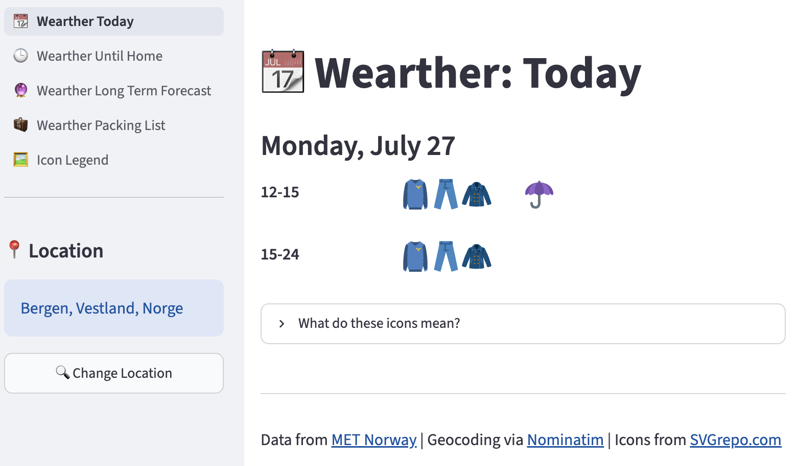

# Wearther 🌦️

Wearther is a weather recommendation app that replaces traditional weather icons with practical clothing suggestions.

Instead of showing only rain clouds and temperature symbols, Wearther answers a practical question:

> "What should I wear for the weather today?"

The idea came from the rapidly changing weather in Bergen, where knowing whether to bring an umbrella can be more useful than interpreting traditional weather symbols.

## Live Demo

🚀 Try Wearther here: [https://wearther.fly.dev](https://wearther.fly.dev)

Deployed with [Fly.io](https://fly.io/) and automatically updated through GitHub Actions.



## How it works

Wearther fetches weather forecasts and transforms weather conditions into clothing suggestions using rule-based decision logic. The recommendations are generated from hourly weather data and grouped into practical time periods.

Recommendations are generated based on factors such as:

- temperature
- precipitation
- wind
- weather symbols (sun, rain, snow, thunderstorms)

Instead of interpreting traditional weather symbols, users get a practical overview of what clothing items are useful.

## Features

- 🌡️ Temperature-based clothing recommendations
- 🌧️ Rain and snow protection suggestions
- 🌬️ Wind-aware recommendations
- 📍 Search weather recommendations for any location
- 🕒 "Until Home" forecast: see what to wear until you return
- 🧳 Packing list for the coming days

## Tech stack

- Python
- Streamlit
- Pandas
- MET Norway Locationforecast API
- Nominatim geocoding API
- Fly.io (deployment)
- GitHub Actions (CI/CD)

## Run locally

### 1. Clone the repository

```bash
git clone https://github.com/martinelarsen/Wearther.git
cd Wearther
```

### 2. Install dependencies

Create a virtual environment (recommended):

```bash
python -m venv .venv
```

Activate it:

**Windows**
```bash
.venv\Scripts\activate
```

**macOS/Linux**
```bash
source .venv/bin/activate
```

Install required packages:

```bash
pip install -r requirements.txt
```

### 3. Run the application

```bash
streamlit run 1_📆_Wearther_Today.py
```

The application will open automatically in your browser.

## APIs

Weather data:
- [MET Norway Locationforecast API](https://api.met.no/weatherapi/locationforecast/2.0/documentation)

Location search:
- [Nominatim geocoding API](https://nominatim.org/)

Icons:
- [SVG Repo](https://www.svgrepo.com/)

## Project structure

- `pages/` - Streamlit pages (Until Home, Long Term Forecast, Packing List, Icon Legend)
- `utils/` - Weather processing, icon mapping, and UI helpers
- `icons/` - Clothing and weather icons
- `images/` - Images used in documentation
- `.streamlit/` - Streamlit configuration
- `.github/workflows/` - Automatic deployment with GitHub Actions
- `Dockerfile` - Container set-up for Fly.io deployment
- `fly.toml` - Fly.io application configuration